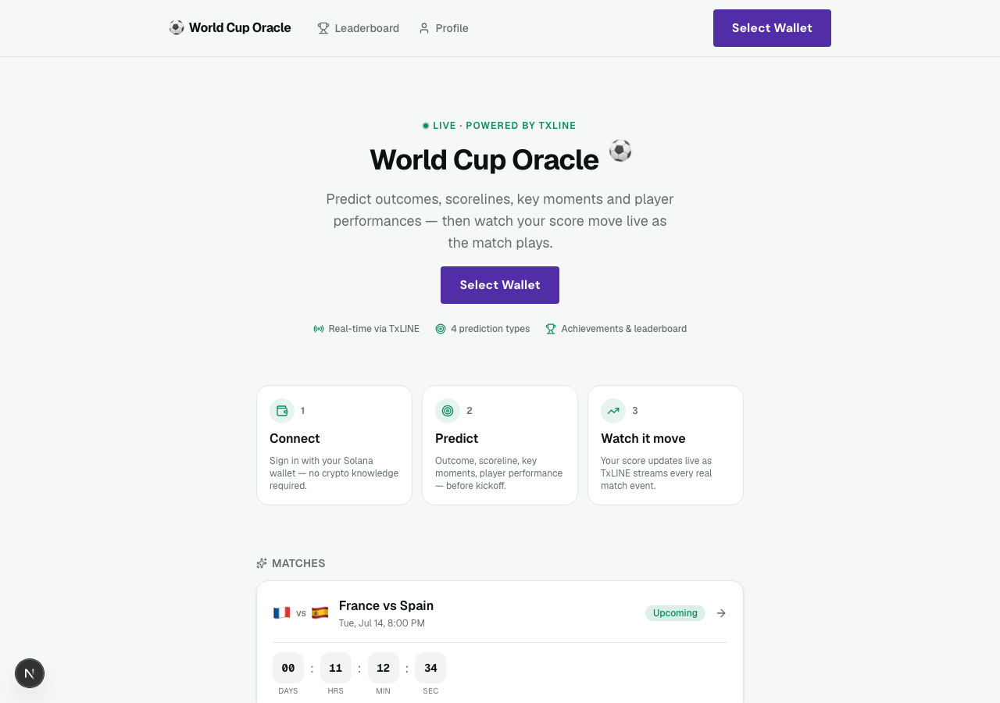
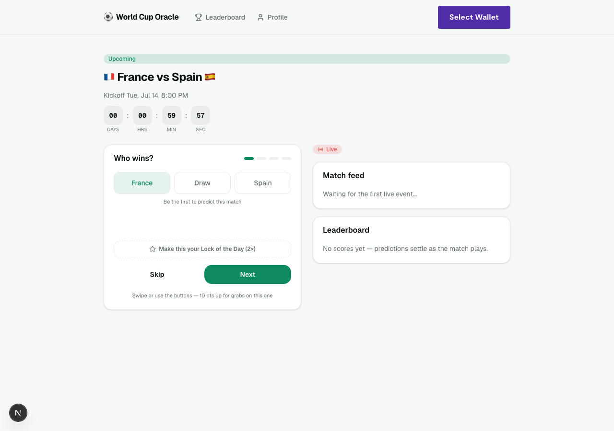
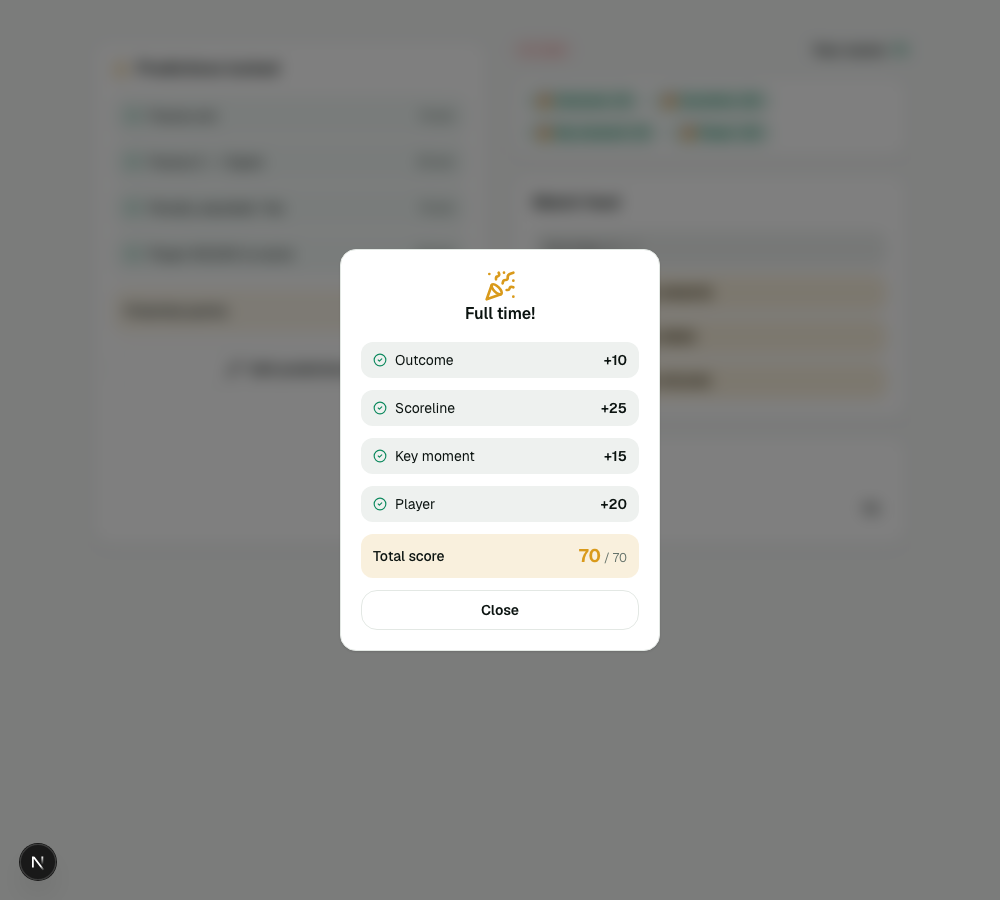
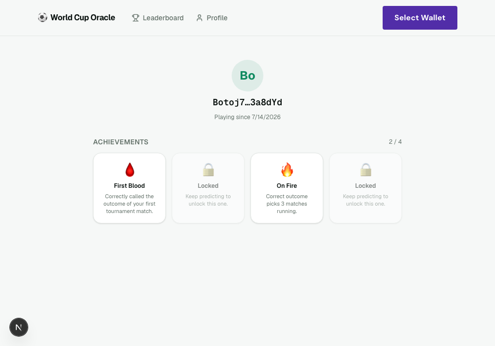
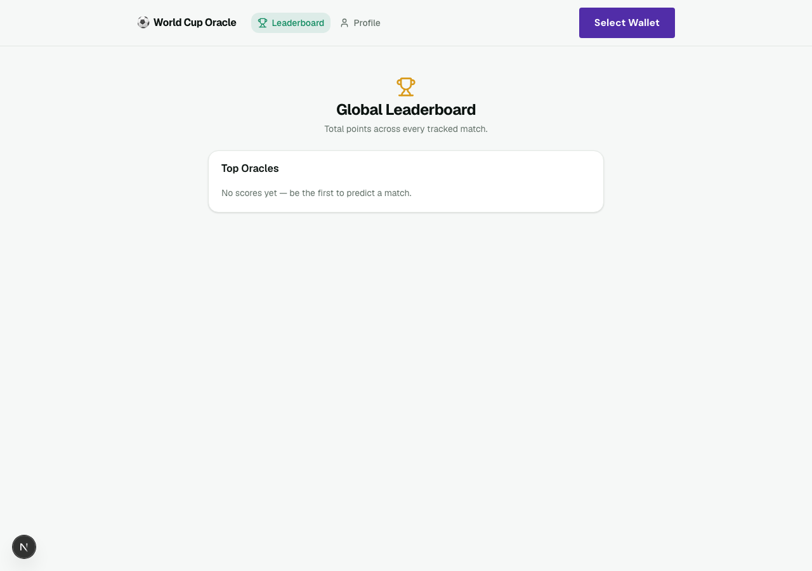

# ⚽ World Cup Oracle

**Prove you know football better than everyone else.**

A real-time World Cup prediction game built for the TxODDS *"Consumer and Fan Experiences"* track on the Superteam Earn World Cup Hackathon. Connect a Solana wallet, predict a match across four categories before kickoff, then watch your score move **live** as TxLINE streams real match events — goals, cards, penalties, substitutions — off the actual pitch.

No mock data. No wireframes. A real Rust backend consuming a real TxLINE SSE feed, driving a real Postgres-backed scoring engine, pushed live over WebSockets to a real Next.js frontend.

<p align="center">
  
</p>

---

## Table of Contents

- [The Idea](#the-idea)
- [Screenshots](#screenshots)
- [Core Loop](#core-loop)
- [What Makes This Real](#what-makes-this-real)
- [Architecture](#architecture)
- [Prediction Types & Scoring](#prediction-types--scoring)
- [Lock of the Day & Consensus](#lock-of-the-day--consensus)
- [Achievements](#achievements)
- [Tech Stack](#tech-stack)
- [TxLINE Integration](#txline-integration)
- [Solana Integration](#solana-integration)
- [Getting Started](#getting-started)
- [Project Structure](#project-structure)
- [Testing & Verification](#testing--verification)
- [TxLINE Feedback](#txline-feedback-the-honest-version)
- [Submission Checklist](#submission-checklist)
- [Roadmap](#roadmap--out-of-scope-for-v1)

---

## The Idea

Most prediction apps are a form: pick a winner, submit, wait. The winner of a hackathon like this isn't the entry with the most features — it's the one with the best **emotional loop**.

So the product question we optimized for wasn't "how many prediction types can we ship," it was: *what does a fan feel, second by second, from the moment they hear about the app to the moment the final whistle blows?*

- **Before kickoff:** predicting isn't filling out a form, it's swiping through bold calls — three quick screens, done in under 30 seconds, ending in a **"Prediction Locked 🔒"** moment with your real points on the line.
- **Waiting for kickoff:** you see real crowd consensus ("62% picked France — 🔥 bold pick if you didn't"), not a fabricated stat.
- **During the match:** your predictions don't just sit there. The moment your locked pick's outcome is decided by a real event, its badge flips from ⏳ pending to 🔥 on track, live, off real TxLINE data.
- **Full time:** a reveal moment — your points broken down by category, right there when the whistle blows, not buried in a profile page you have to go find.
- **After:** a persistent profile with unlockable achievements, and a global leaderboard that makes climbing feel worth coming back for.

Every one of those beats is wired to real data. Nothing here is a static mockup of what the live experience *would* look like.

## Screenshots

| Landing | Prediction Stepper |
|---|---|
|  |  |

| Full-Time Reveal | Profile & Achievements |
|---|---|
|  |  |

| Global Leaderboard |
|---|
|  |

## Core Loop

```
connect wallet → predict before kickoff → watch score update live
     ↑                                          as match events land
     └──────── unlock achievements ← climb the leaderboard ←┘
```

## What Makes This Real

The hackathon's non-negotiable rule is that TxLINE must be a **live input**, not historical/mock data dressed up for a demo. Concretely, right now, this repo:

- Syncs the **real World Cup semi-final schedule** from TxLINE (`GET /api/fixtures/snapshot?competitionId=72`) on every backend startup — not a hardcoded fixture list.
- Opens a **live SSE connection** per tracked match (`GET /api/scores/stream?fixtureId=...`) and feeds every real event through the scoring engine as it happens.
- Activated its TxLINE API access with a **real on-chain Solana transaction** on devnet — not a stub, not a mocked token. See [Solana Integration](#solana-integration).
- Validated its entire event-mapping layer against a **real, complete match** (France 2–0 Morocco, World Cup quarter-final) pulled from `GET /api/scores/historical/{fixtureId}` — 1,116 real events replayed through the live pipeline, all 4 prediction types scoring correctly against the real result.

## Architecture

```
                     TxLINE (real live SSE + REST)
                              │
                              ▼
        Ingestion Service (Rust) — schedule sync + SSE client
        normalizes real TxLINE payloads into an internal MatchEvent enum
                              │
                              ▼
                    Event Bus (tokio broadcast, per match room)
                              │
        ┌─────────────────────┼─────────────────────┐
        ▼                     ▼                      ▼
  Scoring Engine      Achievement Engine      WebSocket Broadcaster
  (Scorable trait,    (rule-based listeners)         │
   one fn per type)           │                       ▼
        │                     │                 Postgres (scores,
        └──────────────┬──────┘                  leaderboard, profile)
                        ▼
              Next.js frontend — live prediction UI, real-time
              score/leaderboard/achievement updates over WebSocket
```

**Design principle:** adding a new prediction type or achievement rule means writing one new function — not touching ingestion, storage, or the websocket layer. Every prediction type implements one shared trait:

```rust
trait Scorable {
    fn score(&self, events: &[MatchEvent]) -> ScoreResult;
}
```

## Prediction Types & Scoring

| Type | What you predict | Points | Resolves |
|---|---|---|---|
| **Outcome** | Home win / Draw / Away win | 10 | Full time |
| **Scoreline** | Exact final score | 25 | Full time |
| **Key Moment** | Red card / Penalty / Extra time — yes or no | 15 | Live, as it happens |
| **Player Performance** | Will Player #X score | 20 | Live, the moment they do |

70 points on the table per match — 140 if your Lock of the Day pick hits.

## Lock of the Day & Consensus

Two mechanics designed specifically to make the *waiting* and *watching* parts of the loop dramatic, not just the predicting part:

- **Lock of the Day** — stake **one** prediction per match on double points. Every prediction type already scores 0-or-full-points, so a lock is just `points × 2` on that row, enforced server-side with a Postgres partial unique index (`idx_predictions_one_lock_per_match`) guaranteeing exactly one lock per match, with lock exclusivity swapped atomically in a transaction.
- **Outcome Consensus** — `GET /predictions/consensus` returns **real aggregate counts** across every submitted prediction for a match. "62% picked France" is a real percentage of real rows, not a placeholder — if nobody's predicted yet, the UI says so instead of inventing a number.

## Achievements

| Key | Name | Unlocks when |
|---|---|---|
| `first_blood` | 🩸 First Blood | Correct outcome call on your first tournament match |
| `perfect_match` | 💯 Perfect Match | Every prediction type correct for one match |
| `streak` | 🔥 On Fire | Correct outcome picks 3 matches running |
| `underdog_eye` | 🐺 Underdog Eye | Called an outcome the odds didn't favor — and it hit |

Locked achievements show up as mystery cards on the profile page rather than being hidden entirely — a small progression hook to keep people coming back.

## Tech Stack

**Backend** — Rust, [Axum](https://github.com/tokio-rs/axum), [`sqlx`](https://github.com/launchbadge/sqlx) (compile-time checked queries), Postgres, `tokio::sync::broadcast` per-match websocket rooms, `reqwest-eventsource` for the live TxLINE SSE client, `ed25519-dalek` + `jsonwebtoken` for wallet-signed session auth.

**Frontend** — Next.js 16 (App Router), Tailwind v4, `framer-motion`, `@solana/wallet-adapter`.

**Chain** — Solana (devnet), used for (1) fan-facing wallet sign-in via a signed message, and (2) a real on-chain `subscribe` transaction against TxLINE's `txoracle` Anchor program to activate live API access. No on-chain program of our own — deliberately: it buys no judging-criteria value here and burns days we don't have (see [Roadmap](#roadmap--out-of-scope-for-v1)).

## TxLINE Integration

Endpoints actually called by this codebase, all against the real TxLINE devnet environment:

| Endpoint | Used for |
|---|---|
| `POST /auth/guest/start` | Guest JWT, refreshed periodically for long-lived streams |
| `POST /api/token/activate` | Exchanging a signed on-chain subscription tx for a long-lived API token |
| `GET /api/fixtures/snapshot?competitionId=72` | Real World Cup schedule sync into `matches` |
| `GET /api/scores/stream?fixtureId=...` | Live per-match SSE event stream |
| `GET /api/scores/historical/{fixtureId}` | Pulled a real completed match (France 2–0 Morocco) to validate the entire event-mapping pipeline against real data before going live |

The real wire format required reverse-engineering from live payloads rather than the OpenAPI spec alone — see the [feedback section](#txline-feedback-the-honest-version) below for specifics, and `backend/src/ingestion/soccer.rs`'s doc comment for the fully verified shape.

## Solana Integration

Two separate, deliberately unrelated uses of Solana:

1. **Fan-facing sign-in.** `@solana/wallet-adapter` in the browser → sign a fixed message → `POST /auth/wallet` verifies the ed25519 signature server-side → session JWT. No on-chain transaction, no gas, no crypto knowledge required from the fan.
2. **Server-side TxLINE activation.** TxLINE requires a **real signed Solana transaction** to activate API access, even on the free tier — a `subscribe(service_level_id, weeks)` call against TxLINE's own `txoracle` Anchor program (`6pW64gN1s2uqjHkn1unFeEjAwJkPGHoppGvS715wyP2J`) using a Token-2022 mint. This runs as a one-time provisioning script (`backend/ops/txline-activate/`), not per-request — confirmed live on devnet, tx [`xPi6rN1g...`](https://explorer.solana.com/tx/xPi6rN1gHKWAstdiTd3Yjam5DNetXvi4GJtN3HCTDcbSeVrqB66DQL8MPz7GUT4yAGb3GD6KVnFf6TB1u8tfeL6?cluster=devnet).

## Getting Started

**Prerequisites:** Rust (2024 edition toolchain), Node.js 20+, Postgres, a devnet-funded Solana keypair (only needed once, to activate TxLINE access).

```bash
# 1. Database
createdb world_cup_oracle

# 2. Backend
cd backend
cp .env.example .env          # fill in DATABASE_URL, SESSION_JWT_SECRET
cargo run                     # applies migrations, syncs the real schedule, opens live streams

# 3. TxLINE activation (one-time — needs a devnet-funded keypair)
cd backend/ops/txline-activate
npm install
solana-keygen new --outfile ./activation-keypair.json
solana airdrop 1 <printed-pubkey> --url https://api.devnet.solana.com
ANCHOR_WALLET=./activation-keypair.json node activate.js
# paste the printed token into backend/.env as TXLINE_API_KEY, restart `cargo run`

# 4. Frontend
cd frontend
cp .env.local.example .env.local
npm install
npm run dev                   # http://localhost:3000
```

## Project Structure

```
backend/
  src/
    api/            REST handlers (auth, predictions, leaderboard, profile)
    domain/
      predictions/   one Scorable impl per prediction type
      achievements.rs rule-based achievement evaluation
    ingestion/
      schedule.rs    real TxLINE fixture sync
      live.rs         real TxLINE SSE consumer
      replay.rs        replays a recorded/historical fixture through the same pipeline
      soccer.rs         raw TxLINE payload → internal MatchEvent mapping
      pipeline.rs       shared ingest step used by both live.rs and replay.rs
    scoring.rs        rescoring + achievement evaluation + leaderboard broadcast
    ws/               per-match websocket rooms
  ops/txline-activate/  one-time Solana devnet activation script (Node, not Rust —
                         see the doc comment on ActivationStrategy for why)
  migrations/

frontend/
  app/
    page.tsx                 landing page
    match/[id]/               prediction stepper + live match panel
    profile/, leaderboard/    persistent profile & global leaderboard
  components/                 shared UI primitives + nav
  lib/                        typed API client, prediction/achievement metadata
```

## Testing & Verification

This project leans hard on **testing against real captured data**, not synthetic fixtures, because the TxLINE wire format turned out to disagree with its own documentation in several important ways (see below) — synthetic test data would have hidden every one of those bugs.

- 22 backend unit tests, several pinned to real payloads captured from `GET /api/scores/historical/18209181` (the real France v Morocco quarter-final), including a regression test for a real crash (`"Score":{}` with neither team present on a live `corner` event) caught during a full-match dry run.
- End-to-end dry run: real wallet-signed login → all 4 prediction types submitted → the real 1,116-event match replayed through the live ingestion pipeline → correct scoring (70/70), correct achievement unlocks, verified via REST and a live websocket listener.
- Lock of the Day and outcome consensus verified with real multi-user flows (two independent wallets, real exclusivity/doubling behavior confirmed against the database).

```bash
cd backend && cargo test && cargo clippy -- -D warnings
cd frontend && npx tsc --noEmit && npx eslint .
```

## TxLINE Feedback (the honest version)

Concrete, specific feedback from actually building against the live API — not an evaluation from reading the docs:

**Friction:**
- The OpenAPI spec for `/api/scores/stream` and `/api/scores/historical/{fixtureId}` describes a camelCase `Scores` schema with soccer-specific fields nested under `dataSoccer`. The **real wire payload is PascalCase end to end** (`FixtureId`, `Action`, `Data`, `Score`) and doesn't match the documented nesting at all. We only caught this by pulling a real historical match and diffing against the spec by hand.
- `GET /api/scores/historical/{fixtureId}` is documented as returning `application/json` (an array of `Scores`). It actually streams **SSE-formatted `data: {...}` lines**, even for a plain `GET` request outside an EventSource. Not wrong, exactly, but the doc doesn't say so.
- Every match action streams in 2–3 stages sharing one `Id` (unconfirmed → confirmed → confirmed-with-richer-data) — a goal's scoring `PlayerId` only shows up on the last stage. This is a reasonable design for a low-latency feed, but it's undocumented, and a naive consumer would double-count or miss data without discovering it the hard way.
- The running/final score lives in `Score.Participant{1,2}.Total.Goals` (absent, not zero, if a side hasn't scored) — not on the per-event `Data` payload where you'd expect it given the rest of the schema.
- The devnet (`txline-dev.txodds.com`) vs production (`txline.txodds.com`) domain split is real and matters (a devnet-signed activation transaction will not work against prod), but it's easy to miss since the main docs default to referencing production — we only found it in the devnet example scripts.

**What worked well:**
- Once the real shapes were understood, the actual streaming architecture (REST snapshot for schedule/reconciliation + SSE tail for live events) is clean and exactly the right shape for a real-time consumer.
- The devnet example scripts (`tx-on-chain` repo) were high quality and saved a lot of time reverse-engineering the on-chain activation flow — PDA seeds, account layout, the works, all directly reusable.
- The free-tier pricing worked exactly as documented once we found the real pricing-matrix row (`service_level_id=1`, confirmed live on-chain at `price_per_week_token=0`) — no surprises, no hidden cost beyond the devnet SOL network fee.

## Submission Checklist

- [x] Public repo
- [x] Uses TxLINE as a genuinely live input (real schedule sync + real SSE ingestion, not mocked)
- [x] Solana sign-in functional (wallet-adapter + signed-message auth)
- [x] Technical doc (this README)
- [x] TxLINE feedback section
- [ ] Deployed, working link for judges
- [ ] Demo video (≤5 min)
- [ ] Confirm Solana sign-in functional in the deployed build

## Roadmap / Out of Scope for v1

Deliberately not built, to protect the judging-criteria-relevant work under a hard deadline:

- On-chain program or on-chain score storage for *our* app — Postgres is faster to ship and judges aren't scoring on-chain state here.
- Freeform/user-generated prediction moments — a UX and scoring nightmare under time pressure; 3 fixed moment types (red card, penalty, extra time) covers the interesting cases.
- Social features beyond the leaderboard (friend groups, private leagues).
- Crowd consensus beyond the outcome type, and richer streak/XP progression — real, deliberate follow-ups, not cut for lack of ideas.
